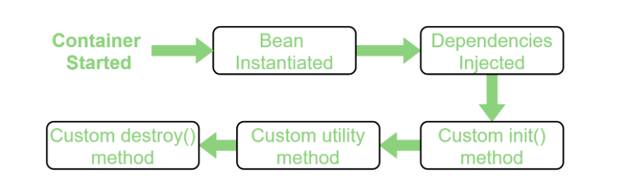

# Конфигурация Spring приложения. XML

Создание XML конфигурации Spring в файле **applicationContext.xml**, файл должен лежать в папке **resources**

```xml
<?xml version="1.0" encoding="UTF-8" ?>
<beans xmlns="http://www.springframework.org/schema/beans"
       xmlns:xsi="http://www.w3.org/2001/XMLSchema-instance"
       xmlns:context="http://www.springframework.org/schema/context"
       xsi:schemaLocation="http://www.springframework.org/schema/beans
    http://www.springframework.org/schema/beans/spring-beans.xsd
    http://www.springframework.org/schema/context
    http://www.springframework.org/schema/context/spring-context.xsd">

    <context:annotation-config/>
    <!-- <bean ...>...</bean> -->
</bean>
```
___

<a name="dependency"></a>
## Способы внедрения зависимости

Внедряемый бин

```Java
<bean id="testBean"     // уникальный индегфикатор бина
        class="com.suleimanov.core.TestBean">
</bean>
```

### Через конструктор (передача аргумента в качестве строки) 

```Java
public TestBean(String name){ this.name = name; }

// applicationContext.xml
<bean id="testBean" class="com.suleimanov.core.TestBean">
    <constructor-arg value="Niko"/>
</bean>
```

### Через конструктор (передача аргумента в качестве объекта)

```xml
public MusicPlayer(RockMusic music) { this.music = music; }

<!-- applicationContext.xml -->
<bean id="musicBean" class="com.suleimanov.core.RockMusic"></bean>

<bean id="musicPlayer" class="com.suleimanov.core.MusicPlayer">
    <constructor-arg ref="musicBean"/> 
</bean>
```

### Через setter 

Внедрение ссылки на объект

```xml
public void setMusic(Music music) { this.music = music; }

<!-- applicationContext.xml -->
<bean id="musicBean" class="com.suleimanov.core.ClassicalMusic"></bean>

<bean id="musicPlayer" class="com.suleimanov.core.MusicPlayer">
    <property name="music" ref="musicBean"/>
    <!-- name - имя сеттера с маленькой буквы -->
</bean>

```

Внедрение простых значений

```xml
public void setName(String name) { this.name = name; }
public void setVolume(String volume) { this.volume = volume; }

<bean id="musicPlayer" class="com.suleimanov.core.MusicPlayer">
    <property name="name" value="Some name"/>
    <property name="volume" value="50"/>
</bean>
```

### Внедрение значений из файла

> расширение файла **.properties** в каталоге **resources**

```xml
<!-- beans.properties -->
musicPlayer.name = Some name
musicPlayer.volume = 70

<!-- applicationContext.xml -->
<context:property-placeholder location="classpath:beans.properties"/>
<!--classpath: - папка resources  -->

<bean id="musicPlayer" class="com.suleimanov.core.MusicPlayer">
    <property name="name" value="${musicPlayer.name}"/>
    <property name="volume" value="${musicPlayer.volume}"/>
</bean>

```
___

## Обращение к конфигурации

```Java
ApplicationContext context = new ClassPathXmlApplicationContext("applicationContext.xml");
TestBean testBean = context.getBean("testBean", TestBean.class);

System.out.println(testBean.getName());
```
> context.getBean - получение бина, в качетсве первого бина указывается id бина, в качетсве второго тот класс бин которого хотим получить
___

<br>


<a name="scopes"></a>
# Bean Scopes

Spring определяет 6 типов областей видимости:

+ singleton
+ prototype
+ request
+ session
+ application
+ websocket

**request**, **session**, **application** и **websocket**, доступны только в веб-приложении.
<br>

## Singleton Scope

bean-компонент с областью `singleton`, контейнер создает один экземпляр этого бина. Все запросы для этого имени компонента будут возвращать один и тот же объект, который кэшируется. Любые изменения объекта будут отражены во всех ссылках на компонент. 
> Эта область является значением по умолчанию, если не указана другая область.

```xml
<bean id="musicPlayer" class="com.suleimanov.core.ClassicalMusic"
        scope="singleton">  <!-- singleton указывать не обязательно --->
</bean>
```

```Java
MusicPlayer musicPlayer1 = context.getBean("musicPlayer", MusicPlayer.class);
MusicPlayer musicPlayer2 = context.getBean("musicPlayer", MusicPlayer.class);

System.out.println(musicPlayer1);   // com.suleimanov.core.MusicPlayer@795cd85e
System.out.println(musicPlayer2);   // com.suleimanov.core.MusicPlayer@795cd85e

System.out.println(musicPlayer2.getVolume());   // 70
musicPlayer1.setVolume(10);
System.out.println(musicPlayer2.getVolume());   // 10
```

<br>

## Prototype Scope

Бин с областью действия `prototype`  будет возвращать другой экземпляр каждый раз, когда запрашивается из контейнера.
```xml
scope="singleton"
```

```Java
MusicPlayer musicPlayer1 = context.getBean("musicPlayer", MusicPlayer.class);
MusicPlayer musicPlayer2 = context.getBean("musicPlayer", MusicPlayer.class);

System.out.println(musicPlayer1);   // com.suleimanov.core.MusicPlayer@402bba4f
System.out.println(musicPlayer2);   // com.suleimanov.core.MusicPlayer@795cd85e

System.out.println(musicPlayer2.getVolume());   // 70
musicPlayer1.setVolume(10);
System.out.println(musicPlayer2.getVolume());   // 70
```
___

<br>

<a name="indemethod"></a>
# Методы бинов (init, destroy, factory)


Жизненный цикл любого бина (объекта) означает: как и когда он появляется, как он себя ведет во время жизни и как и когда он исчезает.

Жизненным циклом управляет спринг-контейнер. После запуска приложения запускается именно он. После этого контейнер по необходимости и в соответствии с запросами создает экземпляры бинов и внедряет необходимые зависимости. Затем бины, связанные с контейнером, уничтожаются когда контейнер завершает свою работу. Поэтому, если мы хотим выполнить какой-то код во время инстанцирования бина или сразу после завершения работы контейнера, то вынесим его в специальные `init()` и `destroy()` методы.



<br>

<a name="indemethod"></a>
## init-method | destroy-method

`init` - метод, который запускается в ходе инициализации бина. Можно использовать для настройки ресурсов, таких как БД/сокет/файл и т.д.

`destroy` - метод, который запускается в ходе угичтожения бина (при завершения приложения). Можно использовать для очищения ресурсов, закрытия потока ввода-вывода, закрытие доступа к БД.


```Java
public class ClassicalMusic implements Music {
    
    @Override
    public String getSong() { return "Classical Music"; }

    private void doInit() { System.out.println("Doing my initialization"); }
    private void doDestroy() { System.out.println("Doing my destruction"); }
}
```

**applicationContext.xml**

```xml
<bean id="musicBean"
        class="com.suleimanov.core.ClassicalMusic"
        init-method="doInit"
        destroy-method="doDestroy"
</bean>
```

```Java
ClassPathXmlApplicationContext context = new ClassPathXmlApplicationContext("applicationContext.xml");

ClassicalMusic classicalMusic = context.getBean("musicBean", ClassicalMusic.class);
System.out.println(classicalMusic.getSong());

context.close();

// Doing my initialization
// Classical Music
// Doing my destruction
```

> Тонокости:
> + может быть любой модификатор доступа (public, protected, private)
> + нельзя получить тип возращаемого, поэтому обычно void
> + методы не должны получать на вход какие-либо аргументы 
> + spring не вызывает `destroy` метод для бинов со **scope "prototype"**

<br>

## factory-method

Фабричный метод - это паттерн программирования. Этот паттерн предлагает создавать объект не напрямую, используя оператор **new**, а через вызов особового **фабричного метода**. Объекты по-прежнему будут создаваться при помощи оператора **new**, но он вызывается из фабричного метода.

```Java
public class ClassicalMusic implements Music {

    private ClassicalMusic() {}

    public static ClassicalMusic getClassicalMusic(){   // обязательно static
        return new ClassicalMusic();
    }

    @Override
    public String getSong() { return "Classical Music"; }
}

```

**applicationContext.xml**
```xml
<bean id="musicBean"
        class="com.suleimanov.core.ClassicalMusic"
        factory-method="getClassicalMusic">
</bean>
```

```Java
ClassPathXmlApplicationContext context = new ClassPathXmlApplicationContext("applicationContext.xml");

ClassicalMusic classicalMusic = context.getBean("musicBean", ClassicalMusic.class);
System.out.println(classicalMusic.getSong());

context.close();

// Classical Music
```
___

[Вернуться назад](../../../README.md)