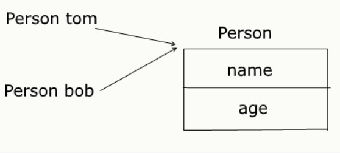

# Ссылочные типы и копирование объектов

При работе с объектами классов надо учитывать, что они все представляют ссылочные типы, то есть указывают на какой-то объект, расположенный в памяти.

```Java
public class Program{
      
    public static void main(String[] args) {
          
        Person tom = new Person("Tom", 23);
        tom.display();      // Person Tom
        Person bob = tom;
        bob.setName("Bob");
        tom.display();      // Person Bob
    }
}
class Person{
    private String name;
    private int age;
     
    Person(String name, int age){
        this.name=name;
        this.age=age;
    }
    void setName(String name){
        this.name = name;
    }
    void display(){
        System.out.printf("Person Name: %s \n", name);
    }
}
```

Здесь создаем два объекта `Person` и один присваиваем другому. Но, несмотря на то, что мы изменяем только объект `bob`, вместе с ним изменяется и объект `tom`. Потому что после присвоения они указывают на одну и ту же область в памяти, где собственно данные об объекте `Person` и его полях и хранятся.




Чтобы избежать этой проблемы, необходимо создать отдельный объект для переменной `bob`, например, с помощью метода `clone`:

```Java
class Person implements Cloneable{
    private String name;
    private int age;
     
    Person(String name, int age){
        this.name=name;
        this.age=age;
    }
    void setName(String name){
        this.name = name;
    }
    void setAge(int age){
        this.age = age;
    }
    void display(){
        System.out.printf("Person %s \n", name);
    }
     
    public Person clone() throws CloneNotSupportedException{
        return (Person) super.clone();
    }
}
```
Для реализации клонирования класс `Person` должен применить интерфейс `Cloneable`, который определяет метод **clone**. Реализация этого метода просто возвращает вызов метода **clone** для родительского класса - то есть класса `Object` с преобразованием к типу Person.

Кроме того, на случай если класс не поддерживает клонирование, метод должен выбрасывать исключение **CloneNotSupportedException**, что определяется с помощью оператора **throws**.

Затем с помощью вызова этого метода мы можем осуществить копирование:

```Java
try{
    Person tom = new Person("Tom", 23);
    Person bob = tom.clone();
    bob.setName("Bob");
    tom.display();      // Person Tom
}
catch(CloneNotSupportedException ex){
                  
    System.out.println("Clonable not implemented");
}
```
___

Однако данный способ осуществляет **неполное копирование**, если клонируемый объект содержит сложных объектов, то необходимо будет реализовать следующее

```Java
class Book implements Cloneable{
 
    private String name;
    private Author author;
     
    public void setName(String n){ name=n;}
    public String getName(){ return name;}
     
    public void setAuthor(String n){ author.setName(n);}
    public String getAuthor(){ return author.getName();}
 
    Book(String name, String author){
         
        this.name = name;
        this.author = new Author(author);
    }
     
    public String toString(){
         
        return "Книга '" + name + "' (автор " +  author + ")";
    }
     
    public Book clone() throws CloneNotSupportedException {
        Book newBook = (Book) super.clone();
        newBook.author = (Author) author.clone();
        return newBook;
    }
}
 
class Author implements Cloneable{
 
    private String name;
     
    public void setName(String n){ name=n;}
    public String getName(){ return name;}
     
    public Author(String name){
     
        this.name=name;
    }

    public Author clone() throws CloneNotSupportedException{
     
        return (Author) super.clone();
    }
}
```

Вызовем

```Java
try{
    Book book = new Book("War and Peace", "Leo Tolstoy");
    Book book2 = book.clone();
    book2.setAuthor("Ivan Turgenev");
    System.out.println(book.getAuthor());   // Leo Tolstoy
}
catch(CloneNotSupportedException ex){
         
    System.out.println("Cloneable not implemented");
}
```

[Вернуться назад](../../README.md)


