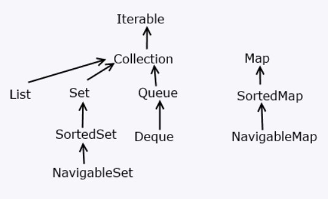

# Типы коллекций. Интерфейс Collection

Коллекции(Collection Framework) - хранение наборов объектов без фиксированной длины, а так же классы коллекций реализуют различные
алгоритмы и структуры данных, например, такие-как стек, очередь, дерево и тд.

> Классы коллекций располагаются в пакете `java.util`


Применяемые интерфейсы, которые определяют базовый функционал:

+ **Collection**: базовый интерфейс для всех коллекций и других интерфейсов коллекций

+ **List**: наследует **Collection**, представляет функциональность простых списков

+ **Set**: наследует **Collection**, используется для хранения множеств уникальных объектов

+
    + **SortedSet**: расширяет интерфейс **Set** для создания сортированных коллекций

+
    + **NavigableSet**: расширяет интерфейс **SortedSet** для создания коллекций, в которых можно осуществлять поиск по
      соответствию

+ **Queue**: наследует **Collection**, представляет функционал в виде очереди

+
    + **Deque**: наследует **Queue**, представляет функционал для двунаправленных очередей

+ **Map**: предназначен для созданий структур данных в виде словаря, где каждый элемент имеет определенный *ключ и
  значение*. Не наследуется от интерфейса **Collection**

Классы коллекций - списки, множества, очереди, отображения и другие:

+ `ArrayList`: простой список объектов

+ `LinkedList`: представляет связанный список

+ `ArrayDeque`: класс двунаправленной очереди, в которой можно произвести вставку и удаление как в начале,
  так и в конце коллекции

+ `HashSet`: набор объектов или хеш-множество, где каждый элемент имеет ключ - уникальный хеш-код

+ `TreeSet`: набор отсортированных, уникальных объектов в виде дерева

+ `LinkedHashSet`: связанное хеш-множество, упорядоченное

+ `PriorityQueue`: очередь приоритетов

+ `HashMap`: структура данных в виде словаря, в котором каждый объект имеет уникальный ключ и некоторое значение

+ `LinkedHashMap`: структура данных в виде словаря и связанного списка, каждый элемент имеет уникальный ключ и некоторое значение, также упорядочены в порядке вставки

+ `TreeMap`: структура данных в виде дерева, где каждый элемент имеет уникальный ключ и некоторое значение


Схематично, иерархия коллекций:



<br>

____

## Интерфейс Collection

Интерфейс **Collection** является базовым для всех коллекций, определяя основной функционал:

```Java
public interface Collection<E> extends Iterable<E> {
  // определения методов
}
```

Интерфейс **Collection** является обобщенным и расширяет интерфейс `Iterable`, поэтому все объекты коллекций можно
перебирать в цикле по типу `for-each`.

<a name="methods"></a>

Основные методы интерфейса `Collection`:

+ `boolean add (E item)`: добавляет в коллекцию объект item. При удачном возвращает **true**, при неудачном - **false**

+ `boolean addAll (Collection<? extends E> col)`: добавляет в коллекцию все элементы из коллекции col. При удачном
  возвращает **true**, при неудачном - **false**

+ `void clear ()`: удаляет все элементы из коллекции

+ `boolean contains (Object item)`: возвращает **true**, если объект item содержится в коллекции, иначе возвращает **
  false**

+ `boolean isEmpty ()`: возвращает **true**, если коллекция пуста, иначе возвращает **false**

+ `Iterator<E> iterator ()`: возвращает объект **Iterator** для обхода элементов коллекции

+ `boolean remove (Object item)`: возвращает **true**, если объект item удачно удален из коллекции, иначе
  возвращается **false**

+ `boolean removeAll (Collection<?> col)`: удаляет все объекты коллекции col из текущей коллекции. Если текущая
  коллекция изменилась, возвращает **true**, иначе возвращается **false**

+ `boolean retainAll (Collection<?> col)`: удаляет все объекты из текущей коллекции, кроме тех, которые содержатся в
  коллекции col. Если текущая коллекция после удаления изменилась, возвращает **true**, иначе возвращается **false**

+ `int size ()`: возвращает число элементов в коллекции

+ `Object[] toArray ()`: возвращает массив, содержащий все элементы коллекции

Все эти и остальные методы, которые имеются в интерфейсе `Collection`, реализуются всеми коллекциями.

[Вернуться назад](../../README.md)