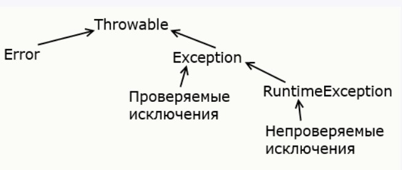

# Классы исключений

Базовым классом для всех исключений является класс `Throwable`. От него уже наследуются два класса: `Error` и `Exception`. Все остальные классы являются производными от этих двух классов.

Класс `Error` описывает внутренние ошибки в исполняющей среде Java. Программист имеет очень ограниченные возможности для обработки подобных ошибок.

Собственно исключения наследуются от класса `Exception`. Среди этих исключений следует выделить класс `RuntimeException`. **RuntimeException** является базовым классом для так называемой группы непроверяемых исключений (**unchecked exceptions**).

Некоторые из классов непроверяемых исключений:
+ **ArithmeticException**: исключение, возникающее при делении на ноль
+ **IndexOutOfBoundException**: индекс вне границ массива
+ **IllegalArgumentException**: использование неверного аргумента при вызове метода
+ **NullPointerException**: использование пустой ссылки
+ **NumberFormatException**: ошибка преобразования строки в число

Все остальные классы, образованные от класса `Exception`, называются проверяемыми исключениями (**checked exceptions**).

+ **CloneNotSupportedException**: класс, для объекта которого вызывается клонирование, не реализует интерфейс Cloneable
+ **InterruptedException**: поток прерван другим потоком
+ **ClassNotFoundException**: невозможно найти класс

Подобные исключения обрабатываются с помощью конструкции **try..catch**. Либо можно передать обработку методу, который будет вызывать данный метод, указав исключения после оператора **throws**:

```Java
public Person clone() throws CloneNotSupportedException{
     
    Person p = (Person) super.clone();
    return p;
}
```
В итоге получается следующая иерархия исключений:




Поскольку все классы исключений наследуются от класса `Exception`, то все они наследуют ряд его методов, которые позволяют получить информацию о характере исключения. Среди этих методов отметим наиболее важные:

+ `getMessage()` возвращает сообщение об исключении
+ `getStackTrace()` возвращает массив, содержащий трассировку стека исключения
+ `printStackTrace()` отображает трассировку стека

```Java
try{
    int x = 6/0;
}
catch(Exception e){
         
    e.printStackTrace();
}
```

[Вернуться назад](../../README.md)